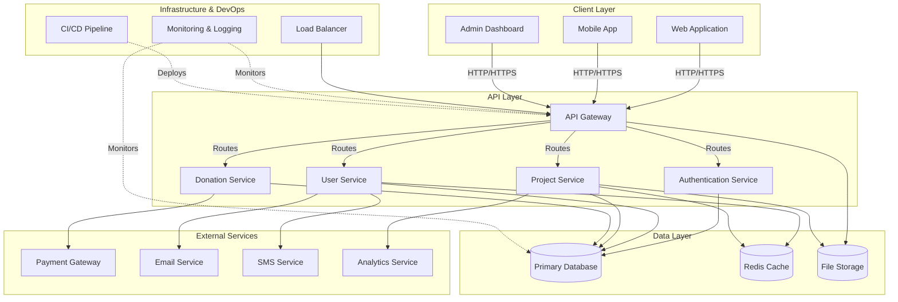

# System Architecture Overview

This document provides a comprehensive overview of the system architecture for the Satkania Lohagara Humanitarian Foundation project.

## Architecture Diagram

## Components Description

### Client Layer
- **Web Application**: Main web interface for users to browse and donate
- **Mobile App**: Native or cross-platform mobile application
- **Admin Dashboard**: Administrative panel for managing projects and donations

### API Layer
- **API Gateway**: Entry point for all client requests, handles routing and load balancing
- **Authentication Service**: Handles user authentication and authorization
- **User Service**: Manages user profiles and account information
- **Project Service**: Manages humanitarian projects and initiatives
- **Donation Service**: Handles donation processing and tracking

### Data Layer
- **Primary Database**: Main relational database for storing application data
- **Redis Cache**: In-memory cache for improving performance
- **File Storage**: Cloud or local storage for images, documents, and media files

### External Services
- **Payment Gateway**: Third-party service for processing donations
- **Email Service**: Automated email notifications and communications
- **SMS Service**: SMS alerts and notifications
- **Analytics Service**: Tracking and analytics for user behavior and project metrics

### Infrastructure & DevOps
- **Load Balancer**: Distributes incoming traffic across multiple servers
- **Monitoring & Logging**: System health monitoring and log aggregation
- **CI/CD Pipeline**: Automated testing and deployment processes

## Data Flow

1. **User Access**: Clients access the system through web, mobile, or admin interfaces
2. **API Processing**: Requests are routed through the API Gateway to appropriate services
3. **Authentication**: All requests are authenticated through the Authentication Service
4. **Data Operations**: Services interact with the database and cache as needed
5. **External Integration**: Services communicate with external APIs as required
6. **Response**: Processed data is returned to the client

## Technology Stack (Recommended)

| Component | Technology |
|-----------|-----------|
| Frontend | React/Vue.js, React Native or Flutter |
| Backend | Node.js/Express, Python/Django, or Java/Spring |
| Database | PostgreSQL or MySQL |
| Cache | Redis |
| Storage | AWS S3 or similar cloud storage |
| Payment | Stripe, PayPal, or local payment gateway |
| Deployment | Docker, Kubernetes |
| CI/CD | GitHub Actions, GitLab CI, or Jenkins |
| Monitoring | ELK Stack, Prometheus, or Datadog |

## Scalability Considerations

- Horizontal scaling of API services behind load balancer
- Database replication and read replicas for scaling reads
- CDN integration for static content delivery
- Message queues for asynchronous operations
- Microservices architecture for independent scaling of components

## Security Considerations

- HTTPS/TLS encryption for all communications
- Role-based access control (RBAC)
- Input validation and sanitization
- SQL injection and XSS protection
- Regular security audits and penetration testing
- Data encryption at rest and in transit

## Disaster Recovery

- Regular database backups
- Multi-region deployment for high availability
- Automated failover mechanisms
- Disaster recovery plan documentation

---

*Last Updated: 2026-06-27*
